# FOLLOW//UP — Proposal Operations

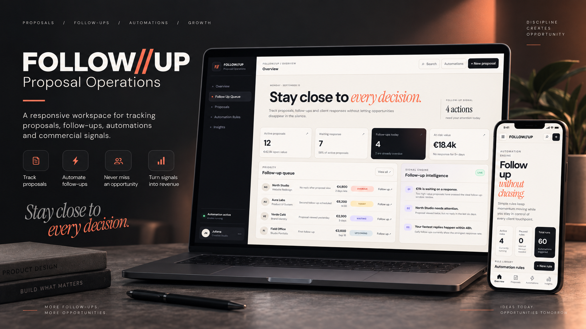

[Live Demo](https://proposal-follow-up-ten.vercel.app) · [View Repository](https://github.com/Lambertiny/proposal-follow-up)

## Overview

**FOLLOW//UP** is a responsive proposal operations workspace designed to help creative studios and service businesses keep commercial conversations moving.

The product brings proposals, follow-up priorities, automation rules and commercial signals into one focused interface — reducing the risk of valuable opportunities disappearing after a proposal is sent.

The project was designed and developed as a complete portfolio case exploring **product design, UI/UX, Vue, TypeScript, responsive front-end architecture and workflow automation concepts**.

---

## Project Highlights

- Multi-page application powered by **Vue Router**
- Fully responsive desktop and mobile experience
- Proposal tracking and commercial status management
- Prioritized follow-up queue
- Interactive automation rules
- Commercial insights and response signals
- Proposal creation workflow
- Search and filtering
- Local persistence with `localStorage`
- Mobile navigation with responsive sidebar
- Production deployment with Vercel
- SPA routing fallback for direct URL access

---

## Product Flow

```text
PROPOSAL
   ↓
CLIENT SIGNAL
   ↓
FOLLOW-UP QUEUE
   ↓
AUTOMATION RULE
   ↓
COMMERCIAL INSIGHT
   ↓
NEXT ACTION
```

The experience is structured around one central question:

> What deserves attention next?

Instead of treating proposals as static documents, FOLLOW//UP treats them as an active commercial workflow.

---

## Overview Dashboard

The dashboard provides a fast reading of the current proposal operation, combining active proposals, pending responses, follow-ups and at-risk commercial value.

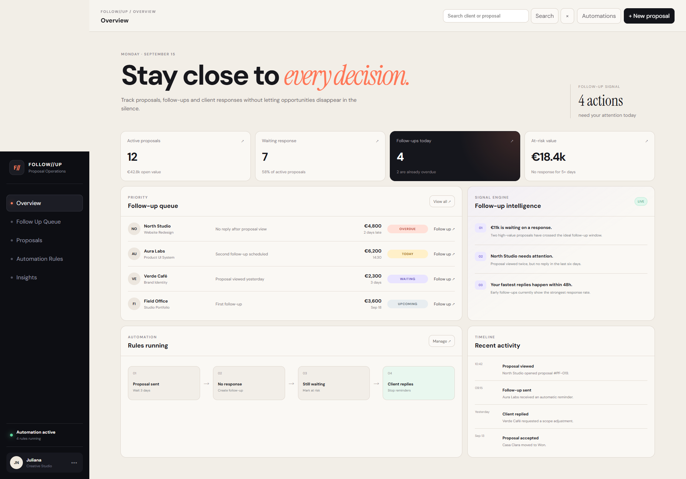

---

## Follow Up Queue

A prioritized workspace for identifying which client conversations require attention.

The queue organizes opportunities by signals such as:

- Overdue
- Due today
- Waiting
- Upcoming

Users can filter follow-ups and complete actions directly from the interface.

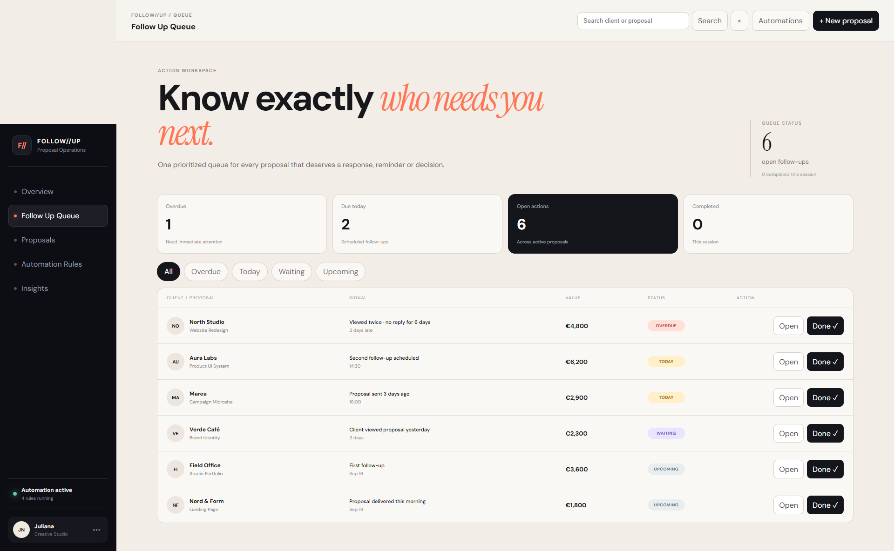

---

## Proposals

The proposal area acts as the commercial memory of the system.

Users can search, filter and inspect proposals according to their current status, value, last signal and next action.

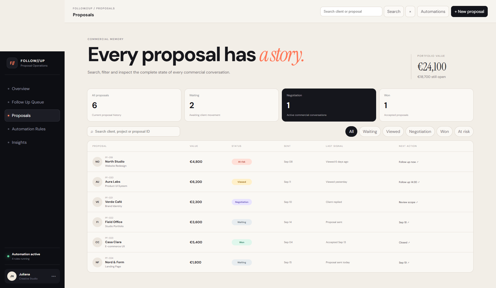

The project also supports creating new proposals, with data persisted locally in the browser through `localStorage`.

---

## Automation Rules

FOLLOW//UP explores rule-based workflow automation for recurring proposal operations.

Examples include:

- creating a follow-up after a period of silence;
- identifying proposals that may be at risk;
- stopping reminders when a client responds;
- increasing priority when a proposal receives repeated views.

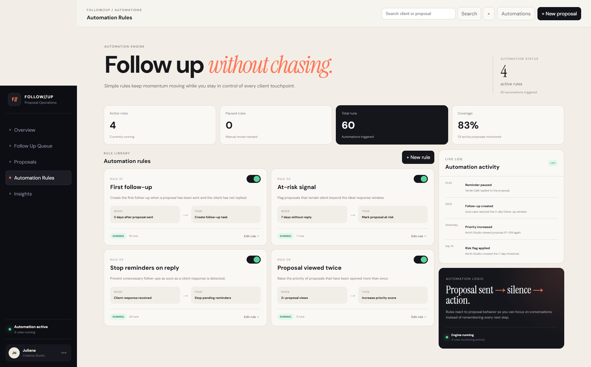

Automation rules can be activated, paused and inspected through an interactive rule interface.

---

## Commercial Insights

The Insights area transforms proposal activity into a clearer decision layer.

It presents signals around:

- response rate;
- average response time;
- won value;
- at-risk value;
- response timing;
- proposal funnel;
- priority opportunities.

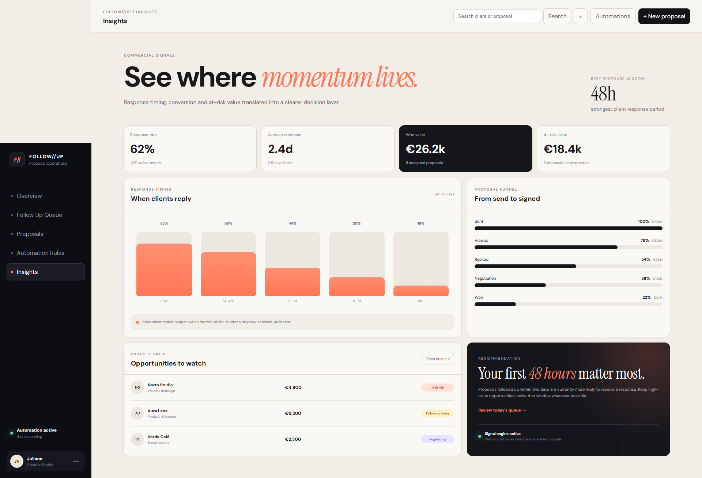

The goal is not only to display data, but to make the next commercial action easier to understand.

---

## Responsive Experience

FOLLOW//UP was designed as a responsive product rather than a desktop interface simply scaled down for mobile.

Navigation, metrics, cards, tables and workflows reorganize according to the available screen width.

### Overview

<p align="center">
  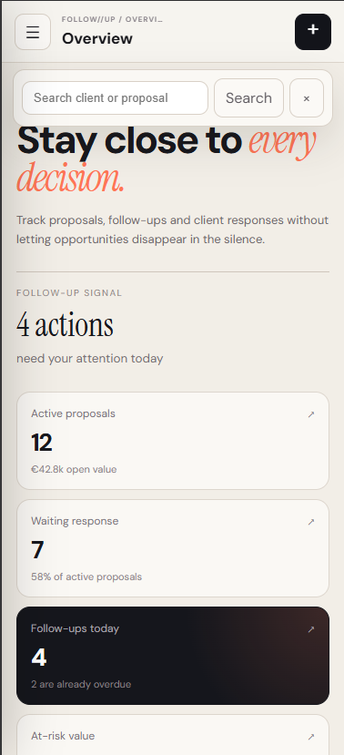
</p>

### Follow Up Queue

<p align="center">
  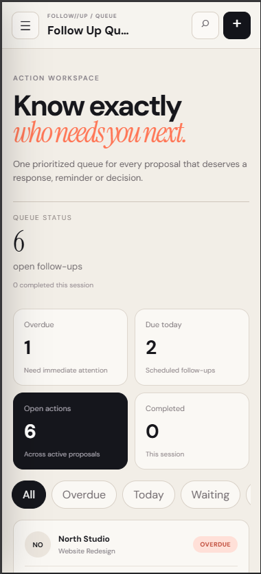
</p>

### Proposals

<p align="center">
  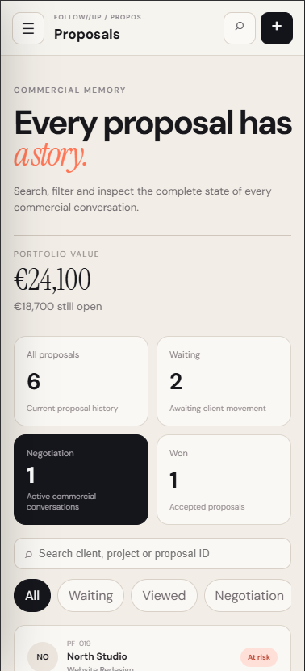
</p>

### Automation Rules

<p align="center">
  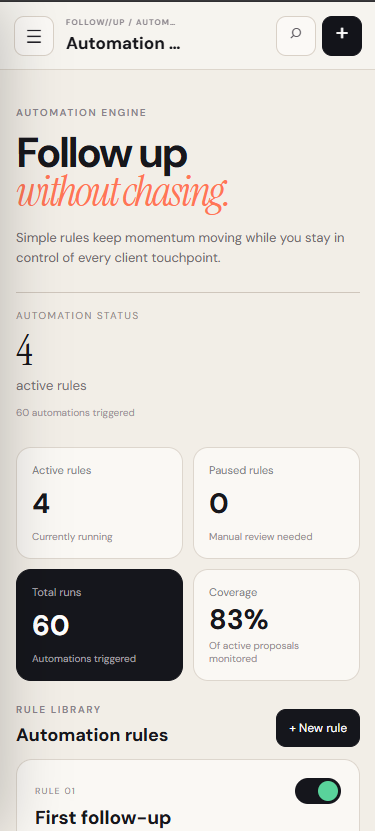
</p>

### Insights

<p align="center">
  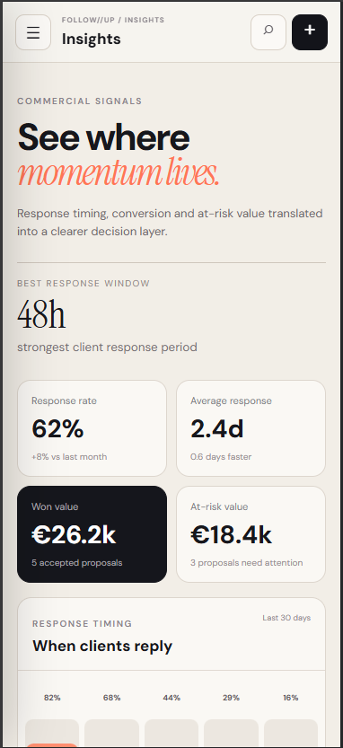
</p>

---

## Interaction & UX

The interface includes functional product interactions such as:

- responsive navigation;
- proposal filtering;
- follow-up status filtering;
- search;
- proposal creation;
- persistent proposal data;
- automation toggles;
- automation activity updates;
- detail drawers;
- direct internal navigation with Vue Router;
- responsive mobile layouts.

The application uses browser-side persistence for portfolio demonstration purposes and does not require a backend or private API credentials.

---

## Technology Stack

**Front-end**

`Vue 3` · `TypeScript` · `Vue Router` · `Vite`

**Interface**

`HTML5` · `CSS3` · Responsive Design · UI/UX · Product Design

**Development & Quality**

`ESLint` · `Oxlint` · `Prettier` · `Vue TSC`

**Deployment**

`GitHub` · `Vercel`

---

## Project Structure

```text
proposal-follow-up/
│
├── public/
├── screenshots/
│   ├── cover-follow-up.png
│   ├── overview-desktop.png
│   ├── queue-desktop.png
│   ├── proposals-desktop.png
│   ├── automations-desktop.png
│   ├── insights-desktop.png
│   ├── overview-mobile.png
│   ├── queue-mobile.png
│   ├── proposals-mobile.png
│   ├── automations-mobile.png
│   └── insights-mobile.png
│
├── src/
│   ├── router/
│   ├── views/
│   ├── App.vue
│   └── main.ts
│
├── vercel.json
├── package.json
└── vite.config.ts
```

---

## Run Locally

Clone the repository:

```bash
git clone https://github.com/Lambertiny/proposal-follow-up.git
```

Enter the project:

```bash
cd proposal-follow-up
```

Install dependencies:

```bash
npm install
```

Start the development server:

```bash
npm run dev
```

Create a production build:

```bash
npm run build
```

---

## Portfolio Note

FOLLOW//UP is a **portfolio product concept** created to demonstrate the design and development of a complete digital product experience.

The project explores the intersection of:

**Product Design · UI/UX · Front-End Development · CRM Concepts · Workflow Automation · Commercial Operations**

It is not presented as a production SaaS platform or as a live client system.

---

## Usage & Rights

© 2026 Juliana Nascimento. All rights reserved.

This repository is publicly available for **portfolio demonstration and professional evaluation**.

The source code, interface design, visual identity, project concept and associated materials may not be commercially reused, redistributed, republished or presented as original work without prior written permission from the author.

---

**Designed & developed by Juliana Nascimento — Lambertiny**
